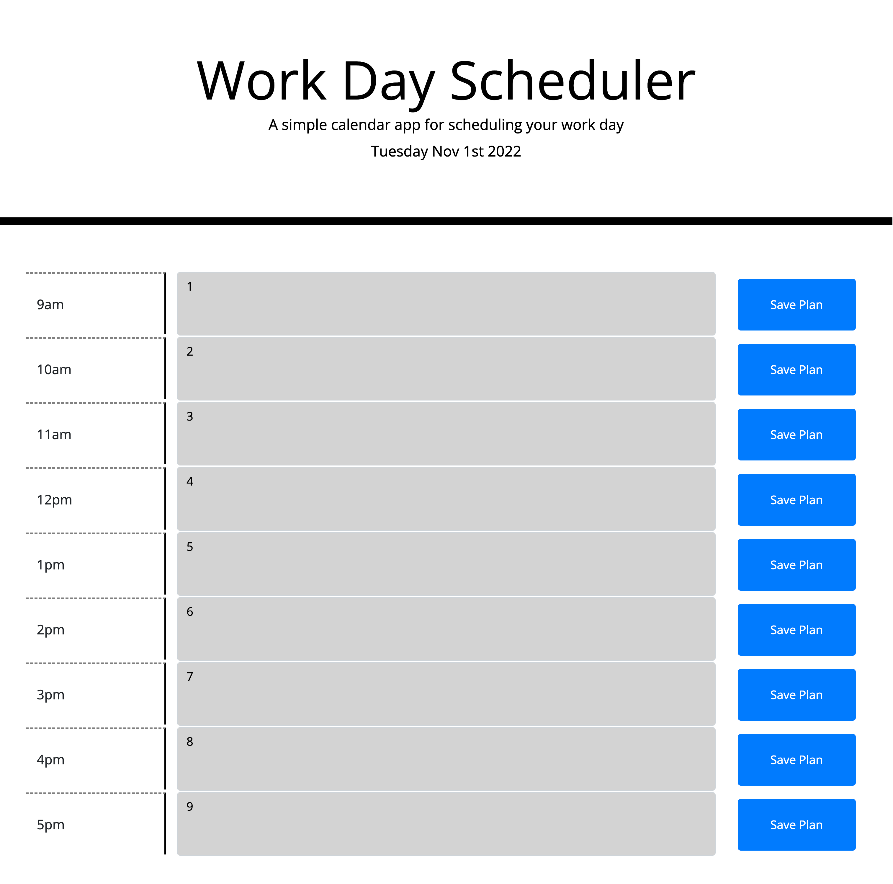

# Day Planner

## Do you often forget tasks throughout your day? What about overbooking yourself?
## If so, this day planner is perfect for you! Outline your day and always be prepared!

- The motivation behind making this day planner was to help people move smart throughout their work days and to be more cautious of their time.

- This project was built with the idea that your time is precious and should be carefully outline with your plans throughout the work day.

- During the process of working on this project, I learned alot about the power of moment js and using API's in a real world sitution. It really opened my eyes to the endless possibilities of using API's.

- You can locate this application at https://rilaey.github.io/day-planner/

